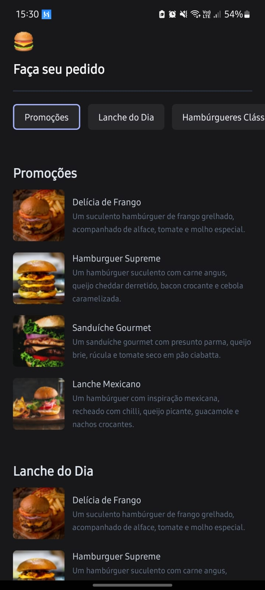
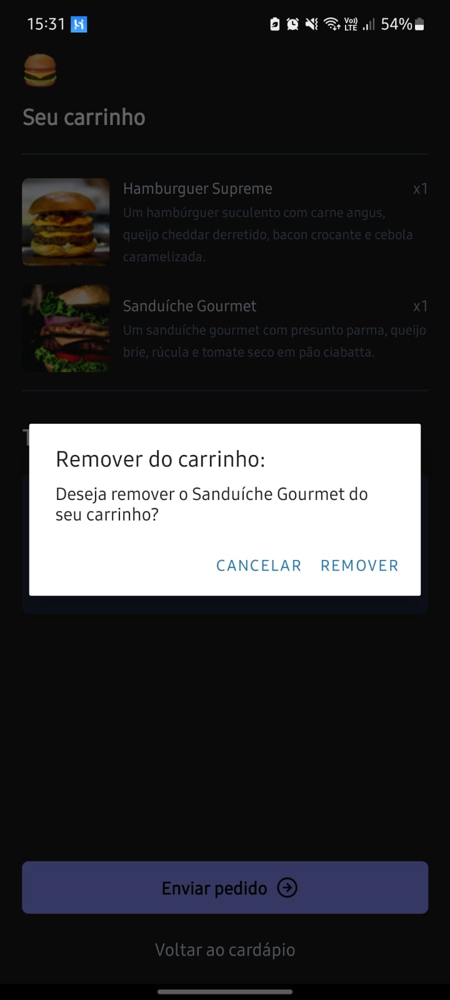
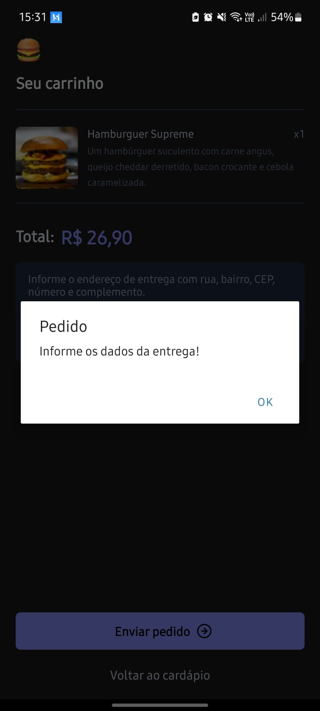
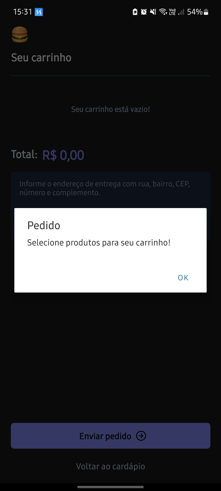

<p align="center">
  
</p>
<h1 align="center">Delivery Orders</h1>

<h4 align="center">Este aplicativo foi desenvolvido em React Native usando Expo e Expo Router, com TypeScript para garantir um código mais seguro e robusto. Inspirado no iFood, ele oferece uma experiência semelhante, permitindo aos usuários escolherem entre uma variedade de lanches e adicioná-los ao carrinho. Foram implementadas várias validações para melhorar a experiência do usuário, como verificação de itens no carrinho e preenchimento do endereço. Além disso, a funcionalidade de enviar o pedido via WhatsApp para a loja de teste foi implementada, tornando o processo de compra mais conveniente.</h4>

## Sumário

- [Tecnologias](#seção-1)
- [Resumo das telas](#seção-2)
- [Resumo de funcionalidades](#seção-3)
- [Oque é necessário para testar o aplicativo?](#seção-4)
- [ScreenShots](#seção-5)

<div id="seção-1">

## Tecnologias

- React-Native
- Expo
- Typescript
- Zustand
- Tailwindcss / Nativewind
- Async Storage

</div>

<div id="seção-2">

## Resumo das telas

Tela inicial - `Listagem de produtos e categorias`

Tela de produto - `Exibe informações do produto selecionado`

Tela do carrinho - `Exibe produtos no carrinho`

</div>

<div id="seção-3">

## Resumo de funcionalidades

Tela inicial - `Garante que a quantidade de produtos seja exibida somente se houver mais de 1` - `Permite que o usúario possa selecionar escolher uma categoria de produto e clicar no produto para exibir`

Tela de produto - `Permite que o usúario possa voltar a tela inicial` - `Permite que o usúario adicione o produto ao carrinho e se já existir no carrinho é acrescentado mais uma unidade`

Tela do carrinho - `Exibe lista de produtos no carrinho` - `Caso não haja produtos uma mensagem e exibida` - `Permite que o usúario informe seu endereço de entrega` - `Garante que exista produtos para envio do pedido` - `Garante que haja endereço para enviar pedido` - `Garante que o usúario possa remover itens de desejado`

</div>

<div id="seção-4">

### Oque é necessário para testar o aplicativo?

- Aplicativo `"Expo Go" baixado na app store ou na play store`

- `Terminal integrado` a um editor de código ou o próprio `Terminal` de seu sistema operacional

```
# Clonar o repositório
git clone https://github.com/FinotelliCarlos/delivery-orders

# Entrar no diretório
cd delivery-orders

# Baixar as dependências utilizando npm
npm install

# Baixar as dependências utilizando yarn
yarn

# Executar a aplicação utilizando expo
npx expo start
```

- Usar seu celular e scanear o QRCODE exibido no terminal e aproveitar

</div>

<div id="seção-5">

## ScreenShots

<div style="display: flex; flex-wrap: wrap; justify-content: center;">
  
  
  
  
  
  
  
  
  
</div>

</div>
